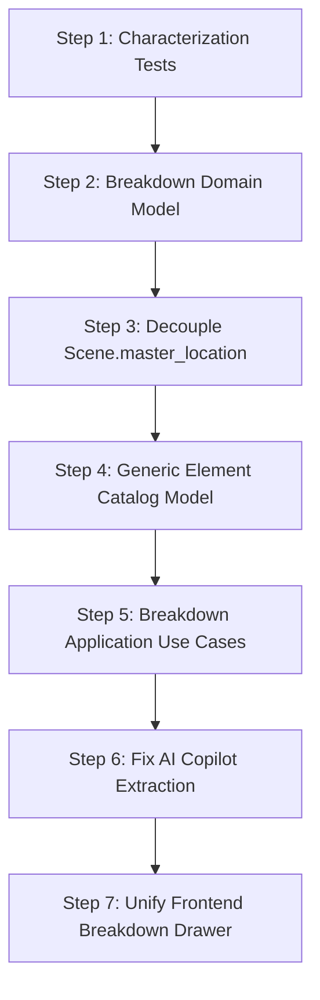

# CineFlow Studio — Pre-Breakdown Architectural Gate Audit

**Document:** Architectural Gate Evaluation & Baseline Review  
**Version:** 1.0  
**Status:** Approved for Architectural Review  
**Target Next Phase:** Evolutionary Redesign of the Breakdown Bounded Context  

---

## Executive Summary

Over the preceding evolutionary rebuild phases, CineFlow Studio has transitioned from a monolithic Django/Next.js implementation toward bounded-context clean architecture. Narrative scene workflows, production logistics (stripboard and DOOD calculations), Celery asynchronous tasks, core infrastructure ports (S3/MinIO, Qdrant, Redis, Channels, Ollama LLM), and frontend API clients have been refactored and fortified with automated architectural enforcement linters.

However, an honest architectural audit reveals that **reorganizing code into directories is not equivalent to clean separation**. While Narrative and Logistics possess true domain models and decoupled infrastructure ports, **Breakdown remains the most architecturally compromised subsystem in the repository**. It has zero domain entities, relies on untyped database queries inside use cases, uses pipe-delimited string serialization inside text columns for non-prop items, contains a broken AI copilot referencing non-existent model attributes, and exhibits bidirectional database coupling with Narrative.

This document provides a comprehensive, evidence-based audit of the current architecture and defines the gate requirements, risks, and roadmap before Breakdown can be safely redesigned.

---

## 1. What Has Been Successfully Migrated

The table below summarizes the architectural status of each bounded context across layers:

| Bounded Context | HTTP / API Routing | Application Use Cases | Domain Layer | Infrastructure Ports & Adapters | Automated Enforcement |
| :--- | :---: | :---: | :---: | :---: | :---: |
| **Narrative (Scenes & Tree)** | ✅ Decoupled (`handlers.py`) | ✅ Complete (`Create`, `Get`, `Update`, `Reorder`) | ✅ Pure (`PageEighths`, `Exceptions`) | ✅ `ISceneRepository` → `DjangoSceneRepository` | ✅ Enforced (0 AST violations) |
| **Logistics (Stripboard & DOOD)** | ✅ Decoupled (`router.py`) | ✅ Complete (`use_cases.py`, `call_sheet`, `finalize_dpr`) | ✅ Pure (`DoodCalculator`, `CastPresence`, `Formatting`) | ✅ `ILogisticsRepository`, `ICallSheetPdfRenderer` | ✅ Enforced (0 AST violations) |
| **Financials (Budget & Accounts)** | ✅ Decoupled (`router.py`) | ✅ Complete (`use_cases.py`) | ✅ Pure (`calculate_budget_summary`) | ✅ `IBudgetRepository` → `DjangoBudgetRepository` | ✅ Enforced (0 AST violations) |
| **Studio & Projects** | ✅ Decoupled (`router.py`) | ✅ Complete (`use_cases.py`) | ✅ Pure (`slugify_title`) | ✅ `IProjectRepository` → `DjangoProjectRepository` | ✅ Enforced (0 AST violations) |
| **Media Connector** | ✅ Decoupled (`router.py`) | ✅ Complete (`use_cases.py`) | ✅ Pure (`classify_media_type`) | ✅ `IMediaRepository`, `IObjectStorage` | ✅ Enforced (0 AST violations) |
| **Core Infrastructure Capabilities** | N/A | ✅ Document Ingestion Use Case | N/A | ✅ `IObjectStorage`, `IVectorSearch`, `ICacheService`, `IEventPublisher`, `ILLMProvider` | ✅ Enforced |
| **Shots & Coverage** | ✅ Decoupled (`router.py`) | ✅ Complete (`use_cases.py`) | ⚠️ Absent (Uses DTOs only) | ✅ `IShotsRepository` → `DjangoShotsRepository` | ✅ Enforced |
| **Breakdown Catalogs** | ⚠️ Partial (Thin Router) | ❌ Inverted (Coupled to ORM & Schemas) | ❌ **Absent (0 Domain Files)** | ⚠️ Leaky (`IBreakdownRepository` returns ORM `Any`) | ✅ Approved Exception Only |

### Key Migration Achievements
1. **Thin API Routers:** Monolithic `config/api.py` was dismantled from 2,300+ LOC down to a 30-line mount table registering bounded-context routers.
2. **Asynchronous Task Architecture:** Celery tasks in [apps/logistics/tasks.py](file:///c:/AI/movie_management/backend/apps/logistics/tasks.py), [apps/narrative/tasks.py](file:///c:/AI/movie_management/backend/apps/narrative/tasks.py), and [apps/core/tasks.py](file:///c:/AI/movie_management/backend/apps/core/tasks.py) are thin infrastructure adapters accepting primitive arguments (`str`, `uuid.UUID`), delegating orchestration to use cases, and handling idempotent retries.
3. **Capability Ports:** Direct third-party vendor SDKs (`boto3`, `qdrant_client`, `redis`, `channels.layers`, `reportlab`) were removed from application and domain logic, isolated behind abstract interfaces in [apps/core/application/ports/](file:///c:/AI/movie_management/backend/apps/core/application/ports/).
4. **Automated Architectural Linters:** Zero-dependency AST checks in [architecture_checker.py](file:///c:/AI/movie_management/backend/apps/core/architecture_checker.py), [test_architecture.py](file:///c:/AI/movie_management/backend/apps/core/test_architecture.py), and [check-architecture.mjs](file:///c:/AI/movie_management/frontend/scripts/check-architecture.mjs) run on every build and CI execution, preventing unauthorized framework imports and direct frontend network bypasses.
5. **Frontend State Boundary:** Centralized HTTP transport in [client.ts](file:///c:/AI/movie_management/frontend/src/lib/api/client.ts), React Query ownership of server state across `@/hooks/`, and Zustand restricted to client UI interaction state in [useProjectStore.ts](file:///c:/AI/movie_management/frontend/src/stores/useProjectStore.ts).

---

## 2. Remaining Technical Debt

Despite the folder reorganization and module migrations, significant architectural debt remains:

### 2.1 Backend Technical Debt
1. **Application Layer Schema Coupling:** In [apps/breakdown/application/use_cases.py](file:///c:/AI/movie_management/backend/apps/breakdown/application/use_cases.py) and [apps/logistics/application/use_cases.py](file:///c:/AI/movie_management/backend/apps/logistics/application/use_cases.py), use cases import HTTP presentation schemas (`from apps.*.api.schemas import ...`) and return Ninja/Pydantic schemas instead of pure application DTOs.
2. **Repository Abstraction Leakage:** [IBreakdownRepository](file:///c:/AI/movie_management/backend/apps/breakdown/application/ports.py) types return values as `Any` or `List[Any]`. In practice, [DjangoBreakdownRepository](file:///c:/AI/movie_management/backend/apps/breakdown/infrastructure/django_breakdown_repository.py) returns active Django ORM model instances (`SceneBreakdownItem`, `MasterLocation`, `Prop`). Application use cases subsequently navigate ORM relations (`item.costume.character.name`, `loc.scenes.all()`), triggering uncontrolled lazy database queries.
3. **Narrative Acts/Sequences Legacy Endpoints:** While the Narrative Scene slice was migrated to use cases and handlers in [handlers.py](file:///c:/AI/movie_management/backend/apps/narrative/api/handlers.py), Act and Sequence endpoints in [apps/narrative/api/router.py](file:///c:/AI/movie_management/backend/apps/narrative/api/router.py#L46-L100) still execute direct ORM queries (`project.acts.prefetch_related(...)`, `CameraSetup.objects.filter(...)`) inline inside router functions.
4. **Script Ingestion Heuristics:** [apps/narrative/services.py](file:///c:/AI/movie_management/backend/apps/narrative/services.py) contains `parse_fountain_script()`, which uses naive regex parsing that dumps all imported scenes into a single hardcoded `"Parsed Act 1"` and `"Parsed Sequence 1"`. Word count heuristics (`words / 25`) estimate page eighths without calculating physical screenplay line counts.

### 2.2 Frontend Technical Debt
1. **Large Breakdown Catalog Components:** While `StripboardView.tsx` and `ShotsSetupsDrawer.tsx` were decomposed, [CharactersTab.tsx](file:///c:/AI/movie_management/frontend/src/components/breakdown/CharactersTab.tsx) remains an un-decomposed 451-line component containing character forms, look bibles, and image uploads.
2. **Dual Client Usage in Legacy Breakdown Tabs:** Breakdown tabs ([LocationsTab.tsx](file:///c:/AI/movie_management/frontend/src/components/breakdown/LocationsTab.tsx), [PropsTab.tsx](file:///c:/AI/movie_management/frontend/src/components/breakdown/PropsTab.tsx)) import from the legacy backward-compatibility facade `@/lib/api` rather than the modular `@/hooks/useBreakdown` hooks or `@/lib/api/breakdown`.
3. **Absence of Frontend Automated Unit/Integration Tests:** The frontend currently relies entirely on TypeScript compilation (`tsc --noEmit`), ESLint, and manual browser verification. There are no Jest or Vitest characterization tests protecting frontend component behavior.

---

## 3. Remaining Dependency Violations

The automated backend dependency checker currently passes because approved exceptions are registered in `APPROVED_APPLICATION_INFRA_IMPORTS`. However, an architectural audit must inspect the reality behind those exceptions:

```
PROHIBITED DEPENDENCY GRAPH (Currently masked by allowlist):

apps/breakdown/application/use_cases.py
  ├── imports django.db.models.Q (Direct ORM query construction)
  ├── imports apps.breakdown.models.* (Direct ORM entity dependencies)
  ├── imports apps.narrative.models.Project, Scene (Cross-context ORM models)
  ├── imports apps.breakdown.infrastructure.DjangoBreakdownRepository (Concrete adapter fallback)
  └── imports apps.breakdown.api.schemas.* (Outward coupling to HTTP presentation)
```

### Specific Boundary Violations:
1. **Circular Cross-Context Foreign Key:** [apps/narrative/models.py](file:///c:/AI/movie_management/backend/apps/narrative/models.py#L74) defines:
   ```python
   master_location = models.ForeignKey(
       'breakdown.MasterLocation', on_delete=models.SET_NULL, null=True, blank=True, related_name='scenes'
   )
   ```
   Narrative directly couples its core `Scene` database model to Breakdown's `MasterLocation`. Simultaneously, Breakdown models (`SceneBreakdownItem`) link to `narrative.Scene`.
2. **Breakdown Application depending on Narrative ORM Models:** [apps/breakdown/application/use_cases.py](file:///c:/AI/movie_management/backend/apps/breakdown/application/use_cases.py#L16) directly imports `from apps.narrative.models import Project, Scene` and executes queries across narrative sequence and act boundaries (`Scene.objects.filter(sequence__act__project=loc.project)`).
3. **Unsanctioned AI Copilot ORM Usage:** [apps/breakdown/ai_copilot.py](file:///c:/AI/movie_management/backend/apps/breakdown/ai_copilot.py#L7) imports `from django.shortcuts import get_object_or_404` and directly queries `Scene`, `Prop`, `Character`, `CostumeLook`, and `SceneBreakdownItem`.

---

## 4. Test Coverage Gaps

While 61 backend characterization tests currently pass, there are significant gaps in test safety:

| Subsystem / Workflow | Covered Scenarios | Critical Gaps | Risk Level |
| :--- | :--- | :--- | :---: |
| **Breakdown Elements** | List elements, add element, get breakdown summary, list catalog entities. | **`POST /api/breakdown/scenes/{scene_id}/ai-copilot` is completely untested.** Cascade deletion of elements and look updates are unverified. | 🔴 HIGH |
| **Breakdown AI Copilot** | None (0 tests). | Node execution in LangGraph, entity extraction fallback, catalog matching. | 🔴 CRITICAL |
| **Script Import & Sync** | None (0 tests). | `POST /api/narrative/projects/{id}/import-script` has no characterization test. Script re-import and scene re-numbering conflicts are untested. | 🔴 HIGH |
| **Stripboard Concurrency** | Reorder strip, schedule scene, delete strip. | Concurrent LexoRank collisions when multiple users reorder strips simultaneously. | 🟡 MEDIUM |
| **DPR Finalization & Lock** | Finalize DPR use case, lock status. | Enforcing edit locks on shoot days and scenes once DPR is finalized. | 🟡 MEDIUM |
| **Frontend Integration** | Typecheck and architecture linter only. | User interaction flows, drag-and-drop state updates, optimistic UI rollbacks. | 🟡 MEDIUM |

---

## 5. Current Domain Model Limitations

The domain layer exhibits sharp contrast between well-modeled and un-modeled contexts:

```
┌─────────────────────────────────────────────────────────────┐
│                    NARRATIVE & LOGISTICS                    │
│   Genuine Domain Models:                                    │
│   - PageEighths (Value Object with fractional arithmetic)   │
│   - DoodCalculator (SAG-AFTRA work-rule domain service)     │
│   - CastPresence (Pure mapping projection)                  │
│   - SceneDetailDTO / CreateSceneCommand (Clean DTOs)        │
└─────────────────────────────────────────────────────────────┘
                              vs
┌─────────────────────────────────────────────────────────────┐
│                          BREAKDOWN                          │
│   Persistence Artifacts Masquerading as Domain:             │
│   - SceneBreakdownItem (Junction table with null FKs)       │
│   - MasterLocation (Flat database row)                      │
│   - Character & Prop (Anemic CRUD records)                  │
│   - custom_notes pipe-delimited text serialization          │
│   - NO Aggregate Root, NO Invariants, NO Domain Services    │
└─────────────────────────────────────────────────────────────┘
```

### Critical Limitations:
1. **Absence of a Breakdown Aggregate Root:** There is no concept of a `BreakdownSheet` or `SceneBreakdown`. Breakdown items are loose rows floating in the database with an FK to `scene_id`. Business invariants (such as preventing duplicate characters in a scene, validating hero prop quantities, or ensuring continuity across sequences) cannot be enforced because there is no domain boundary.
2. **Screenplay Stored as Opaque JSON:** `Scene.script_data` is an untyped `models.JSONField(default=dict)`. Across the codebase:
   - [agent_tools.py](file:///c:/AI/movie_management/backend/apps/core/agent_tools.py#L147) looks for `scene.script_data["blocks"]`.
   - [breakdown/application/use_cases.py](file:///c:/AI/movie_management/backend/apps/breakdown/application/use_cases.py#L300) looks for `scene.script_data["text"]`.
   - [logistics/domain/cast_presence.py](file:///c:/AI/movie_management/backend/apps/logistics/domain/cast_presence.py#L43) iterates over raw block dicts.
   Screenplay text is not a structured document model; it is an arbitrary JSON dictionary with no schema validation.

---

## 6. Breakdown-Specific Architectural Problems

Breakdown is the most fragile subsystem in CineFlow Studio. The following concrete defects exist in active code:

### 6.1 The Broken AI Copilot Runtime Bug
In [apps/breakdown/ai_copilot.py](file:///c:/AI/movie_management/backend/apps/breakdown/ai_copilot.py#L78-L118):
```python
# apps/breakdown/ai_copilot.py:78
SceneBreakdownItem.objects.get_or_create(
    scene=scene,
    item_type='PROP',       # ❌ BUG: Field 'item_type' does not exist!
    item_id=prop.id         # ❌ BUG: Field 'item_id' does not exist!
)

# apps/breakdown/ai_copilot.py:93
SceneBreakdownItem.objects.get_or_create(
    scene=scene,
    item_type='CHARACTER',  # ❌ BUG: Field does not exist!
    item_id=character.id    # ❌ BUG: Field does not exist!
)
```
In [apps/breakdown/models.py](file:///c:/AI/movie_management/backend/apps/breakdown/models.py#L64-L71), `SceneBreakdownItem` has fields `element_type`, `prop`, `costume`, and `custom_notes`. If `run_ai_copilot` is executed against a scene, it crashes at runtime with `TypeError: Field 'item_type' does not exist on SceneBreakdownItem`. This bug went unnoticed because there was zero test coverage for the endpoint.

### 6.2 Pipe-Delimited String Serialization
Because `SceneBreakdownItem` only has foreign keys for `Prop` and `CostumeLook`, all other element categories (Vehicles, Stunts, SFX, VFX, Sound, Special Equipment, Makeup) are serialized into a freeform string column with pipes in [apps/breakdown/application/use_cases.py](file:///c:/AI/movie_management/backend/apps/breakdown/application/use_cases.py#L204):
```python
# Creating an element:
custom_notes = f"{payload.name} | {payload.description}" if payload.description else payload.name

# Parsing an element on read:
name = item.custom_notes.split("|")[0].strip() if "|" in item.custom_notes else item.custom_notes
desc = item.custom_notes.split("|")[1].strip() if "|" in item.custom_notes else ""
```
This string serialization creates data corruption risks, breaks SQL filtering and indexing, and prevents foreign key integrity.

### 6.3 Dual Competing APIs for the Same Data
The breakdown router exposes two overlapping APIs:
1. `GET/POST /api/breakdown/projects/{project_id}/scenes/{scene_id}/elements`: Returns `{"elements": [{"id", "category", "name", "description"}]}` using `ElementIn`.
2. `GET/POST /api/breakdown/scenes/{scene_id}/items`: Returns `List[SceneBreakdownItemOut]` using `SceneBreakdownItemIn` (which takes `prop_id`, `costume_id`).

In the frontend:
- [ElementTaggingPanel.tsx](file:///c:/AI/movie_management/frontend/src/components/breakdown/ElementTaggingPanel.tsx) calls `/elements`.
- [DepartmentBreakdownDrawer.tsx](file:///c:/AI/movie_management/frontend/src/components/studio/DepartmentBreakdownDrawer.tsx) calls `/items`.
Two independent mental models and API contracts exist for the exact same entity.

### 6.4 Expensive Fuzzy Searches in Detail Resolvers
In [apps/breakdown/application/use_cases.py](file:///c:/AI/movie_management/backend/apps/breakdown/application/use_cases.py#L46-L110), resolving character and location details performs ad-hoc fuzzy scans:
```python
# build_character_detail:
if linked_scenes_count == 0:
    for sc in Scene.objects.filter(sequence__act__project=project):
        blocks = (sc.script_data or {}).get("blocks", [])
        if any(b.get("type") == "character" and char_name in b.get("content", "").upper() for b in blocks):
            linked_scenes_count += 1
```
Whenever the character catalog is opened, the backend loads every scene in the project from the database, parses their JSON blobs in Python, and performs string substring searches. This will cause severe latency on feature-length screenplays (120+ scenes).

---

## 7. Why It Is Now Safe — Or Not Yet Safe — to Redesign Breakdown

### Verdict: **CONDITIONALLY SAFE (GREEN LIGHT WITH STRICT PREREQUISITES)**

It is **SAFE** to begin redesigning Breakdown, but **ONLY IF** specific structural guardrails are respected.

```
┌────────────────────────────────────────────────────────────────────────┐
│                   CONDITIONAL SAFETY ASSESSMENT                        │
├────────────────────────────────────────────────────────────────────────┤
│  ✅ STABILIZED FOUNDATIONS:                                            │
│     1. Narrative Scene workflow is isolated behind ISceneRepository.   │
│     2. Logistics Stripboard & DOOD are pure domain calculators.        │
│     3. Infrastructure capability ports (S3, Qdrant, Redis) are solid.  │
│     4. Automated AST linters prevent new unauthorized imports.         │
│     5. All 61 baseline tests pass in 2.5s.                             │
├────────────────────────────────────────────────────────────────────────┤
│  ⚠️ STRICT PRECONDITIONS FOR BREAKDOWN REDESIGN:                       │
│     1. MUST NOT redesign Screenplay engine simultaneously.             │
│     2. MUST preserve existing HTTP contracts for frontend backward    │
│        compatibility during migration.                                 │
│     3. MUST decouple Scene.master_location without breaking migrations.│
│     4. MUST add characterization test for ai-copilot before touching it│
└────────────────────────────────────────────────────────────────────────┘
```

#### Why it is safe now (compared to before):
1. **The Safety Net Exists:** We have 61 passing characterization tests protecting the observable behavior of Narrative, Logistics, Core, and Breakdown summary endpoints.
2. **Automated Enforcement is Active:** Any architectural violation (such as Breakdown importing Celery, Qdrant, Boto3, or Django HTTP) will immediately fail both `python scripts/check_architecture.py` and `python manage.py test`.
3. **Surrounding Contexts are Stable:** Narrative, Logistics, Financials, and Media are no longer shifting. Breakdown can be refactored without chasing moving targets in other apps.

#### Why a blind rewrite would fail:
1. Attempting to redesign Breakdown **and** Screenplay at the same time would create an unmanageable two-front migration. Screenplay must remain read-only during Breakdown redesign.
2. If `SceneBreakdownItem` database columns are dropped or changed without an adapter layer, `DepartmentBreakdownDrawer` and `ElementTaggingPanel` will immediately break.

---

## 8. Recommended Next Steps for Breakdown Redesign

The redesign of Breakdown must proceed via an evolutionary vertical slice, following these sequenced steps:



### Step 1: Add Characterization Tests for Missing Paths
- Write characterization tests for `POST /api/breakdown/scenes/{scene_id}/ai-copilot`.
- Write characterization tests for `POST /api/breakdown/projects/{project_id}/scenes/{scene_id}/elements`.
- Verify behavior under error conditions (invalid element category, non-existent scene).

### Step 2: Establish the Breakdown Domain Layer (`apps.breakdown.domain`)
Create pure Python domain models:
- `BreakdownElement` (Entity): Identity, category (standard 36 film categories), name, description, continuity critical flag.
- `SceneBreakdownSheet` (Aggregate Root): `scene_id`, list of tagged elements, scene notes, page length eighths.
- `ElementCategory` (Value Object / Enum): Standardized film departments (`CAST`, `EXTRAS`, `PROPS`, `WARDROBE`, `MAKEUP`, `VEHICLES`, `STUNTS`, `SFX`, `VFX`, `SOUND`, `SET_DRESSING`, `SPECIAL_EQUIPMENT`, `LIVESTOCK`).

### Step 3: Decouple `Scene.master_location` Circular Dependency
- Replace `Scene.master_location` ForeignKey with a decoupled identifier reference `location_id: Optional[uuid.UUID]`.
- Provide a read-only `ILocationLookupPort` so Narrative does not import `apps.breakdown.models`.

### Step 4: Replace Pipe-String Serialization with Generic Element Table
- Replace the fragmented `Prop`, `CostumeLook` + `custom_notes` pipe hack with a unified `ProductionElement` table and `SceneElementTag` junction model.
- Provide database migration scripts preserving existing props, costume looks, and parsed custom notes.

### Step 5: Implement Pure Application Use Cases & Ports
- Refactor `IBreakdownRepository` to return typed domain entities or DTOs, never raw Django ORM models.
- Eliminate `django.db.models.Q` and ORM model imports from [apps/breakdown/application/use_cases.py](file:///c:/AI/movie_management/backend/apps/breakdown/application/use_cases.py).
- Separate application use cases into single-responsibility modules:
  - `tag_scene_element.py`
  - `untag_scene_element.py`
  - `get_scene_breakdown.py`
  - `manage_catalogs.py`

### Step 6: Fix and Test AI Copilot Pipeline
- Correct `apps/breakdown/ai_copilot.py` to use the new domain repository and valid entity fields.
- Wrap extraction behind the existing `ILLMProvider` port.

### Step 7: Unify Frontend Breakdown Presentation
- Consolidate [DepartmentBreakdownDrawer.tsx](file:///c:/AI/movie_management/frontend/src/components/studio/DepartmentBreakdownDrawer.tsx) and [ElementTaggingPanel.tsx](file:///c:/AI/movie_management/frontend/src/components/breakdown/ElementTaggingPanel.tsx) into a cohesive breakdown panel.
- Ensure all queries and mutations use `@/hooks/useBreakdown.ts`.

---

## 9. Recommended Principles for the Future Screenplay Engine

Once Breakdown is stabilized, the Screenplay engine can be addressed. The future screenplay engine must adhere to the following architectural principles:

```
┌────────────────────────────────────────────────────────┐
│              FUTURE SCREENPLAY ARCHITECTURE            │
├────────────────────────────────────────────────────────┤
│  1. Screenplay as an Immutable, Versioned Document AST │
│  2. Token Nodes: Slugline, Action, Character, Dialogue │
│  3. Breakdown as an Annotation Layer (Span Anchors)    │
│  4. Fountain / FDX Parsers as Infrastructure Adapters  │
│  5. Scene Boundary Detection as a Domain Service       │
└────────────────────────────────────────────────────────┘
```

### Principle 1: Screenplay as an Abstract Syntax Tree (AST), Not an Opaque JSON Blob
Screenplay content must not be stored as freeform text or unstructured JSON dictionaries in `Scene.script_data`. The Screenplay domain must define a strongly-typed AST:
- `ScreenplayDocument` (Aggregate Root)
- `ScreenplayBlock` (Node Entity): `id`, `type`, `text`, `character_name`, `dual_dialogue_flag`, `revision_color`
- Standard Node Types: `SCENE_HEADING`, `ACTION`, `CHARACTER`, `DIALOGUE`, `PARENTHETICAL`, `TRANSITION`, `SHOT`, `PAGE_BREAK`.

### Principle 2: Breakdown as an Annotation Overlay, Not Content Duplication
Breakdown tags must not duplicate character names or prop descriptions into separate unstructured text fields. Instead, a Breakdown Tag must reference an AST span anchor:
```
BreakdownTag = {
    element_id: UUID,
    scene_id: UUID,
    start_block_id: "blk-104",
    start_offset: 12,
    end_offset: 24,
    highlight_color: "#F59E0B"
}
```
This enables the lined-script editor and screenplay view to display breakdown tags directly inline over script dialogue and action lines.

### Principle 3: Screenplay Versioning & Revision Tracking (Industry Revision Colors)
Film scripts evolve across production revisions (White, Blue, Pink, Yellow, Green, Goldenrod, Buff, Salmon, Cherry). 
- Every edit to a screenplay document must produce an immutable revision snapshot.
- Changes to scene text must not silently overwrite breakdown elements or stripboard schedules. Scene deletion or dialogue changes should trigger "stale breakdown tag" notifications rather than silent cascade deletions.

### Principle 4: Parsers as Infrastructure Adapters
Fountain (`.fountain`), Final Draft (`.fdx`), and PDF formats are external transport encodings:
- Parsers must live in `apps/screenplay/infrastructure/parsers/`.
- Parsers must implement `IScreenplayParserPort` and return a domain `ScreenplayDocument` AST.
- Domain rules (e.g. calculating scene page length in eighths) must live in domain services, calculated deterministically from standard script formatting line measurements (55 lines per page).

---

## 10. Summary Checklist Before Redesigning Breakdown

Before opening the Breakdown refactoring task, ensure the following checklist is satisfied:

- [x] All 61 backend characterization tests pass cleanly (`python manage.py test`).
- [x] Automated architecture checker passes with 0 violations (`python scripts/check_architecture.py`).
- [x] Frontend architecture checker passes with 0 violations (`npm run check:architecture`).
- [x] Frontend TypeScript compiles with 0 errors (`npx tsc --noEmit`).
- [x] CI workflow is active and green (`.github/workflows/ci.yml`).
- [x] Narrative Scene workflow is fully stabilized as the reference implementation.
- [x] Logistics DOOD and Stripboard are isolated behind capability ports.
- [ ] Characterization test for Breakdown AI copilot added.
- [ ] Target Breakdown domain schema designed and reviewed.
